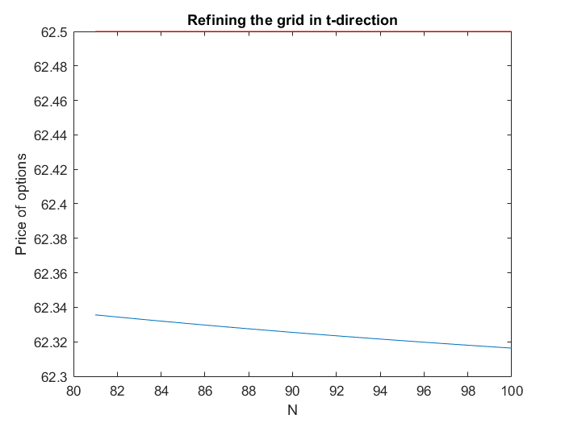

# Valuation of European options with Finite Difference-approximations of the Black-Scholes PDE
  

This project concern valuations of three types of options using the Black Scholes model with a finite difference method (FDM). The following option payoffs will be considered:

**A plain vanilla call option:** 

**An asset or nothing call option:** 

**A cash or nothing call option:** 

where  is the indicator function. These are defined below as function handles, where they are also defined as functions in terms of the variable , as this change of variable will be utilised for solving the PDE with the method used in Andersen, Brotherton-Ratcliffe (1997).

```matlab:Code
    Call = @(S,K) max(S-K,0);
ABR_Call = @(X,K) Call(exp(X),K);
ABR_CoN  = @(X,K)         (exp(X) >= K);
ABR_AoN  = @(X,K) exp(X).*(exp(X) >= K);
```

Furthermore, the PDE solver will require upper and lower bounds for the option value, i.e. what happens to the option when . The first case implies that the call options are worthless, while for the upper limit, the following limits are proposed:

**Plain Vanilla:** 

**Asset or Nothing:** 

**Cash or Nothing:** 

```matlab:Code
randCall     = @(S,K,r,t) (S-K*exp(-r*t));
randABR_Call = @(X,K,r,t) randCall(exp(X),K,r,t);
randABR_CoN  = @(X,K,r,t) exp(-r*t);
randABR_AoN  = @(X,K,r,t) exp(X);
```

The following data is also provided for a particular Plain Vanilla option (where C is the market price today):

```matlab:Code
K = 2370;
S0 = 2367.921;
r = 0.05e-2;
T = wrkdydif("08/27/2021","11/19/2021",0)/252; 
%Time to 3rd Friday in Nov with 252 market days
C = 62.5;
```

Using this, one can find the implied volatility of the option by setting the Black-Scholes theoretical price (assuming no continuous divdend payment):


equal to the market price and solving for the volatility . As that equation has no analytical solution, numerical methods must be used. In this case, Steffensen's method is used, where the root seeking is given by:


This is used on the function (as the method works for finding the roots of a function):


Where  indicates that all other parameters of the pricing formula are treated as constants.

```matlab:Code
d1 = @(S0, K, r, vol, T)(log(S0/K)+(r+0.5*vol^2)*T)/(vol*sqrt(T));
d2 = @(S0, K, r, vol, T)     (d1(S0, K, r, vol, T) - vol*sqrt(T));
BS_call = @(S0, K, r, vol, T) (S0*normcdf(d1(S0,K,r,vol,T)) - ...
                               K*exp(-r*T)*normcdf(d2(S0,K,r,vol,T)));

find_sigma = @(vol) (BS_call(S0,K,r,vol,T) - C); 
%Sensitive in terms of initial guess
vol = Steffe(find_sigma, 0.15, 1e-9, 500) 
```

```text:Output
vol = 0.1364
```

With the implied volatility found, the Black-Scholes PDE, given by:


can be solved numerically. By approximating the derivatives on an equidistant grid, by:


where  is the time index and  is the price index. Inserting these expressions into the PDE with  yields:


Also, at all times , all values  are known, so the expression can be rearranged for the single unknown variable in the expression as:


The same procedure for  results in:


Once again rearranging to have all unknown variables on the left hand side:


For , while for  the boundary values are known, so one has:


Solving this for a particular value of  can then be described as a tridiagonal linear system of equations, i.e.  where  is the unknown for all , and the non-zero values on the lower diagonal, main diagonal and upper diagonal of  are given by:


It can thus easily be LU-decomposed, after which solving  can be done easily by backwards and forward substitution.

The final parameters to decide upon before running the numerical solver are the upper and lower bounds of the grid . This value is set such that the probability of the spot price being inside the grid at maturity is 99.9%. With  following from the Black-Scholes assumptions of  following a Geometric Browninan Motion, one can solve for  as:


Where  and  is the CDF of the standard Gaussian distribution. Similiarly (substituting 0.0005 for 0.9995 in the above expression) one gets .

Solving the system with ,  and , and interpolating between the nodes with a cubic spline yields:

```matlab:Code
M = 30;
N = 80;
theta = 1;

Sl = S0*exp(vol*sqrt(T)*norminv(0.0005)+(r-0.5*vol^2)*T);
Su = S0*exp(vol*sqrt(T)*norminv(0.9995)+(r-0.5*vol^2)*T);

% Call ordinary solver
[C_FDM, delta_FDM] = solver(M, N, Sl, Su, theta, K, T, vol, ...
                            r, S0, Call, randCall, true)
```


```text:Output
C_FDM = 62.3369
delta_FDM = 0.5045
```

```matlab:Code
% Compare delta with analytical value from Black Scholes
delta_BSM = normcdf(d1(S0, K, r, vol, T))
```

```text:Output
delta_BSM = 0.5089
```

Where the numerical approximation of  comes from the derivative approximation:


where  corresponds to the node closest to the spot price today.

One can also examine how the coarseness of the grid affects the solution, by varying the values of  and . Varying them one at a time yields:

```matlab:Code
C_SIncr = zeros(20,1);
C_tIncr = zeros(20,1);

for i = 1:20
    C_SIncr(i) = solver(M+i, N,   Sl, Su, theta, K, T, ...
                        vol, r, S0, Call, randCall, false);
    C_tIncr(i) = solver(M,   N+i, Sl, Su, theta, K, T, ...
                        vol, r, S0, Call, randCall, false);
end

figure();
plot((M+1):(M+20), C_SIncr);
line((M+1):(M+20),C*ones(20,1),"col","red");
title("Refining the grid in S-direction"); 
xlabel("M"); 
ylabel("Price of option");
```


```matlab:Code
figure();
plot((N+1):(N+20), C_tIncr); title("Refining the grid in t-direction");
line((N+1):(N+20),C*ones(20,1),"col","red");
xlabel("N"); 
ylabel("Price of options");
```



The oscilations in the first plot can be attributed to the effect of the boundary conditions at  as, depending on if the spacing of nodes, an even or odd number of nodes will end up respectively out of the money, explaining the zig-zaggy behaviour.

This implementation does also suffer some numerical drawbacks. A way to robustify the solver is introducing the change of variable  and correspondingly, . This yields the following modified PDE:


which has the nice property that the coefficients are now all constants (compared to the original PDE where they depend of ).

```matlab:Code
[C_ABR, delta_ABR] = solver_ABR(M, N, log(Sl), log(Su), theta, K, T, vol, r, ...
                                log(S0), ABR_Call, randABR_Call, true)
```


```text:Output
C_ABR = 62.5361
delta_ABR = 0.5446
```

Let's first analyse the speed of convergence, for the cases  (explicit FDM),  (Crank-Nicholson) and  (implicit FDM) with the new method, by varying the grid spacing in one variable at a time as before.

```matlab:Code
thetaVals = 0:0.5:1;
C_SIncr_ABR = zeros(20,3);
C_tIncr_ABR = zeros(20,3);

M = 36; % Good approximation according to the plot

cnt = 1;
figure();
len = 25;
for i = 1:3
    for j = 1:len
        C_SIncr_ABR(j,i) = solver_ABR(M+j, N,   log(Sl), log(Su), ...
            thetaVals(i), K, T, vol, r, log(S0), ABR_Call, randABR_Call, false);
        C_tIncr_ABR(j,i) = solver_ABR(M  , N+j, log(Sl), log(Su), ...
            thetaVals(i), K, T, vol, r, log(S0), ABR_Call, randABR_Call, false);
    end
    % Plot convergence
    subplot(3,2,cnt),   plot((M+1):(M+len), C_SIncr_ABR(:,i)); 
    title("S-direction when \theta=" + thetaVals(i)); 
    line((M+1):(M+len),C*ones(len,1),"col","red");
    subplot(3,2,cnt+1), plot((N+1):(N+len), C_tIncr_ABR(:,i)); 
    title("t-direction when \theta=" + thetaVals(i)); 
    line((N+1):(N+len),C*ones(len,1),"col","red");
    cnt = cnt+2;
end
```

  
  

It can be shown that for , the method can become unstable, which can be seen in the downmost left figure. The theoretical limit of stability is given by . This is examined below for an option with the same properties as before, only changing the maturity to .

```matlab:Code
stable = 1;
```


```matlab:Code
M_test = 30;
N_test = N;
C_10y = BS_call(S0, K, r, vol, 10); % Analytical price for T = 10Y

while stable
   % Modify S_l och S_u considering new time
   [C_test,~] = solver_ABR(M_test, N_test, log(0.5*Sl), log(2*Su), ...
       1, K, 10, vol, r, log(S0), ABR_Call, randABR_Call, false);
   disp([M_test, C_test])
   if (C_test < 0.8*C_10y || C_test > 1.2*C_10y ) 
       %Unstable if price starts diverging
       stable = 0;
   else
       M_test = M_test + 1; % grow M (reduce delta_X^2/delta_T)
   end
end
```

Comparing the theoretical limit with the one obtained in this analysis shows that they are consistant.

```matlab:Code
lim = [(N_test-1)*(log(2*Su)-log(0.5*Sl))^2/(10*(M_test-1)^2), vol^2]
```

The demonstration shows that the method works reasonably well for the case of a plain vanilla call option. Any european option can however be valued, by just modifying the payoff function and the boundary values entered in the FDM solver. Below, Asset or Nothing and Cash or Nothing options, as well as plain vanilla options are valued with the implicit and explicit method, and the errors compared to the theoretical pricing formulas, which are:

**Cash or Nothing:** 

**Asset or Nothing:** 

with  and  defined as before, are measured.

```matlab:Code
M = 60;
N = 100;
[CoN_impl, ~] = solver_ABR(M, N, log(Sl), log(Su), 0, K, T, vol, r, ...
                           log(S0), ABR_CoN,  randABR_CoN,  true);
```


```matlab:Code
[AoN_impl, ~] = solver_ABR(M, N, log(Sl), log(Su), 0, K, T, vol, r, ...
                           log(S0), ABR_AoN,  randABR_AoN,  true);
```


```matlab:Code
[CoN_expl, ~] = solver_ABR(M, N, log(Sl), log(Su), 1, K, T, vol, r, ...
                           log(S0), ABR_CoN,  randABR_CoN,  false);
[AoN_expl, ~] = solver_ABR(M, N, log(Sl), log(Su), 1, K, T, vol, r, ...
                           log(S0), ABR_AoN,  randABR_AoN,  false);
[C_impl,   ~] = solver_ABR(M, N, log(Sl), log(Su), 0, K, T, vol, r, ...
                           log(S0), ABR_Call, randABR_Call, false);

CoN_BSM = exp(-r*T)*normcdf(d2(S0, K, r, vol, T));
AoN_BSM =        S0*normcdf(d1(S0, K, r, vol, T));

% Absolute percentage error
CoN_err = 100*abs([CoN_impl, CoN_expl]-CoN_BSM)/CoN_BSM 
```

```text:Output
CoN_err = 1x2    
    3.7266    3.6999

```

```matlab:Code
 AoN_err = 100*abs([AoN_impl, AoN_expl]-AoN_BSM)/AoN_BSM
```

```text:Output
AoN_err = 1x2    
    3.5214    3.5093

```

```matlab:Code
Call_err = 100*abs([C_impl, C_ABR]-C)/C
```

```text:Output
Call_err = 1x2    
    0.2308    0.0577

```

The results show how the pricing errors are larger for the exotic options, possibly owning to the discontinuity around  which is visible in the plots above. This could quite possibly lead to worse approximations of the derivative close to that region, thus leading to higher errors.

# Functions used in the script
## Steffensen's Method for Root Finding

```matlab:Code
function [root] = Steffe(f,x0,tol,iter)
%% Steffensen method for finding roots of a function f(x)

   xVals = zeros(iter+1,1);
%  save the initial guess
   xVals(1) = x0;
%% Perform Steffensen for a fixed number of iterations
   for k = 1:iter
      fk  = f(xVals(k));
      fxf = f(xVals(k) + fk);
      xVals(k+1) = xVals(k) - fk^2/(fxf-fk);

      % check the stopping condition
      stopCond = abs(f(xVals(k+1)));
      if stopCond < tol
         xVals = xVals(1:k+1);
         break;
      end
   end
 root = xVals(end);
end
```

## Thomas Algorithm for LU-decomposing Tridiagonal Matrices

```matlab:Code
function [L,U] = thomas(A)
% Decomposing A=LU for tridiagonal square matrices A using Thomas Algorithm

     n  = length(A);
   for j = 1:n-1
      A(j+1,j) = A(j+1,j)/A(j,j); %L-component
      A(j+1,j+1) = A(j+1,j+1) - A(j+1,j)*A(j,j+1); %diagonal U-component
   end

   U = triu(A);
   L = eye(n) + tril(A,-1);
end
```

## Backward/Forward-substitution for Solving the LU-factorised System

```matlab:Code
function x = LUsolve(L, U, rhs)
    % Solves the system L*U*x = rhs through forward and backward substitution
    
    n = length(L);
    c = zeros(n,1);
    c(1) = rhs(1);
    
    % L*c = rhs
    for i = 2:n
        c(i) = rhs(i)-L(i,i-1)*c(i-1);
    end
    
    % Ux = c
    x= zeros(n,1);
    x(end) = c(end)/U(n,n);
    
    for i = n-1:-1:1
        x(i) = (c(i)-U(i,i+1)*x(i+1))/U(i,i);
    end
end
```

## The "Ordinary" Black-Scholes PDE solver

```matlab:Code
function [C_FDM, delta] = solver(M, N, Sl, Su, theta, K, T, ...
                                 vol, r, S0, payoff_f, ubound_f, plt)
% Returns todays price and an approximate option-delta
% As well as a plot of the price function
% by solving the Black-Scholes PDE with FDM 

    %% Solver Parameters
    deltaT = T/(N-1);
    deltaS = (Su-Sl)/(M-1);
    
    S = linspace(Sl, Su, M)'; % All points (incl. boundaries)
    
    grid = zeros(M,N);
    
    % Boudnary values at vid t=T (payoff)
    grid(:,N) = payoff_f(S,K);
    
    %% Create the matrices A (for Ax=b) and B (to make the vector b)
    main_diag  =    -(1-theta)*(vol*S(2:end-1)/deltaS).^2 -r -deltaT^-1;
    lower_diag = 0.5*(1-theta)*( -r*S(3:end-1)/deltaS + (vol*S(3:end-1)/deltaS).^2);
    upper_diag = 0.5*(1-theta)*(  r*S(2:end-2)/deltaS + (vol*S(2:end-2)/deltaS).^2);
    
    A = diag(main_diag,0) + diag(upper_diag,1) + diag(lower_diag,-1);
    
    m_diag  =  0.5*theta*(  r*S(2:end-1)/(deltaS) - (vol*S(2:end-1)/deltaS).^2);
    u_diag  =      theta*(vol*S(2:end-1)/deltaS).^2 - deltaT^-1;
    uu_diag = -0.5*theta*(  r*S(2:end-1)/(deltaS) + (vol*S(2:end-1)/deltaS).^2);
    
    B = zeros(M-2,M);
    
    for i = 1:(M-2)
        B(i,i)   = m_diag(i);
        B(i,i+1) = u_diag(i);
        B(i,i+2) = uu_diag(i);
    end
    
    % LU-facrotise A 
    % A tridiagonal, can use Thomas-algoritm
    [L, U] = thomas(A); 
    
    %% Solve for interior points
    % interior points
    for i = (N-1):-1:1
        
        % Boundary values
        grid(1,i) = 0;
        grid(M,i) = ubound_f(S(M), K, r, T-(i-1)*deltaT); %S(M) - K*exp(r*(T-(i-1)*deltaT));
        
        % Right hand side (f_i+1 terms)
        rhs = B*grid(:,i+1);
        
        % Move boundary values to rhs
        rhs(1)   = rhs(1)   -0.5*(1-theta)*(-r*S(2)/deltaS   + ...
                            (vol*S(2)/deltaS)^2)  *grid(1,i); 
        rhs(end) = rhs(end) -0.5*(1-theta)*( r*S(M-1)/deltaS + ...
                            (vol*S(M-1)/deltaS)^2)*grid(M,i); 
    
        % Solve system for interior points f_i and store in grid
        grid(2:M-1,i) = LUsolve(L, U, rhs);
    
    end
    
    % Interpolate price today with cubic spline
    C_FDM = spline(S, grid(:,1),S0);
    
    %% Approximate delta, given FDM-discretisation
    % Find node index closest to S = S0
    [~,idx] = min(abs(S-S0));
    delta = (1-theta)*(grid(idx+1,1) - grid(idx-1,1))/(2*deltaS) + ...
                theta*(grid(idx+1,2)-grid(idx-1,2))/(2*deltaS);
    
    %% Plot f(t, S_t)
    if plt
        figure();
        [pltT, pltS] = meshgrid(T:-deltaT:0, Sl:deltaS:Su);
        surf(pltT, pltS, grid);
        xlabel("T-t"), ylabel("S_t"), zlabel("f(t, S_t)")
        title("OMX Nov Call, K =" + K)
    end
end
```

## The Andersen, Brotherton-Ratcliffe Method for Solving the PDE

```matlab:Code
function [C_FDM, delta] = solver_ABR(M, N, xl, xu, theta, K, T, vol, r, X0, payoff_f, ubound_f, plt)
    % Returns todays price and an approximate option-delta
    % As well as a plot of the price function
    % by solving the Black-Scholes PDE with FDM 
    % and the change of variable X = ln(S)
    % as proposed in Andersen, Brotherton-Ratcliffe (1997)

    %% Solver Parameters
    deltaT = T/(N-1);
    deltaX = (xu-xl)/(M-1);
    
    X = linspace(xl, xu, M)'; % All points (incl. boundaries)
    
    grid = zeros(M,N);
    
    % Boudnary values at vid t=T (payoff)
    grid(:,N) = payoff_f(X,K);
    
    %% Create the matrices A (for Ax=b) and B (to make the vector b)
    main_diag  =    -(1-theta)*(vol/deltaX).^2 -r -deltaT^-1;
    lower_diag = 0.5*(1-theta)*(-(r-0.5*vol^2)/deltaX + (vol/deltaX).^2);
    upper_diag = 0.5*(1-theta)*( (r-0.5*vol^2)/deltaX + (vol/deltaX).^2);
    
    A = diag(main_diag*ones(M-2,1),0) + diag(upper_diag*ones(M-3,1),1) + ...
        diag(lower_diag*ones(M-3,1),-1);
    
    m_diag  =  0.5*theta*(  (r - 0.5*vol^2)/(deltaX) - (vol/deltaX).^2);
    u_diag  =      theta*(vol/deltaX).^2 - deltaT^-1;
    uu_diag = -0.5*theta*(  (r - 0.5*vol^2)/(deltaX) + (vol/deltaX).^2);
    
    B = zeros(M-2,M);
    
    for i = 1:(M-2)
        B(i,i)   = m_diag;
        B(i,i+1) = u_diag;
        B(i,i+2) = uu_diag;
    end
    
    % LU-facrotise A 
    % A tridiagonal, can use Thomas-algoritm
    [L, U] = thomas(A); 
    
    %% Solve for interior points
    % interior points
    for i = (N-1):-1:1
        
        % Boundary values
        grid(1,i) = 0;
        %exp(X(M)) - K*exp(r*(T-(i-1)*deltaT));
        grid(M,i) = ubound_f(X(M),K,r,T-(i-1)*deltaT);
        
        % Right hand side (f_i+1 terms)
        rhs = B*grid(:,i+1);
        
        % Move boundary values to rhs
        rhs(1)   = rhs(1)   -0.5*(1-theta)*(-(r - 0.5*vol^2)/deltaX   + ...
                  (vol/deltaX)^2)*grid(1,i); 
        rhs(end) = rhs(end) -0.5*(1-theta)*( (r - 0.5*vol^2)/deltaX   + ...
                  (vol/deltaX)^2)*grid(M,i); 
        
        % Solve system for interior points f_i and store in grid
        grid(2:M-1,i) = LUsolve(L, U, rhs);
        
    end
    
    % Interpolate price today with cubic spline
    C_FDM = spline(X, grid(:,1),X0);
    
    %% Approximate delta, given FDM-discretisation
    % Find node index closest to S = S0
    [~,idx] = min(abs(X-X0));
    delta = exp(-X0)*((1-theta)*(grid(idx+1,1) - grid(idx-1,1))/(2*deltaX) + ...
                          theta*(grid(idx+1,2)-grid(idx-1,2))/(2*deltaX));
    
    %% Plot f(t, X_t)
    if plt
        figure();
        [pltT, pltX] = meshgrid(T:-deltaT:0, xl:deltaX:xu);
        surf(pltT, pltX, grid);
        xlabel("T-t"), ylabel("X_t=ln(S_t)"), zlabel("f(t, X_t)")
        title("OMX Nov Call, K = " + K)
    end
end
```

# References

Andersen, Leif and Rupert Brotherton-Ratcliffe. “The equity option volatility smile: an implicit finite-difference approach.” *Journal of Computational Finance* 1 (1997): 5-37.

Lee, W. T. "Tridiagonal Matrices: Thomas Algorithm". [http://www.industrial-maths.com/ms6021_thomas.pdf](http://www.industrial-maths.com/ms6021_thomas.pdf) 

Wikipedia - The Free Encyclopedia. "Steffensen's Method". [https://en.wikipedia.org/wiki/Steffensen%27s_method](https://en.wikipedia.org/wiki/Steffensen%27s_method) 

Wikipedia - The Free Encyclopedia. "Black-Scholes Model". [https://en.wikipedia.org/wiki/Black%E2%80%93Scholes_model](https://en.wikipedia.org/wiki/Black%E2%80%93Scholes_model)

***
*Generated from FDM_option_pricing.mlx with [Live Script to Markdown Converter](https://github.com/roslovets/Live-Script-to-Markdown-Converter)*
